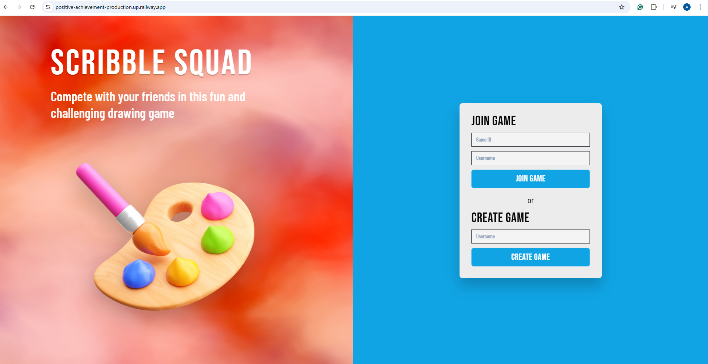
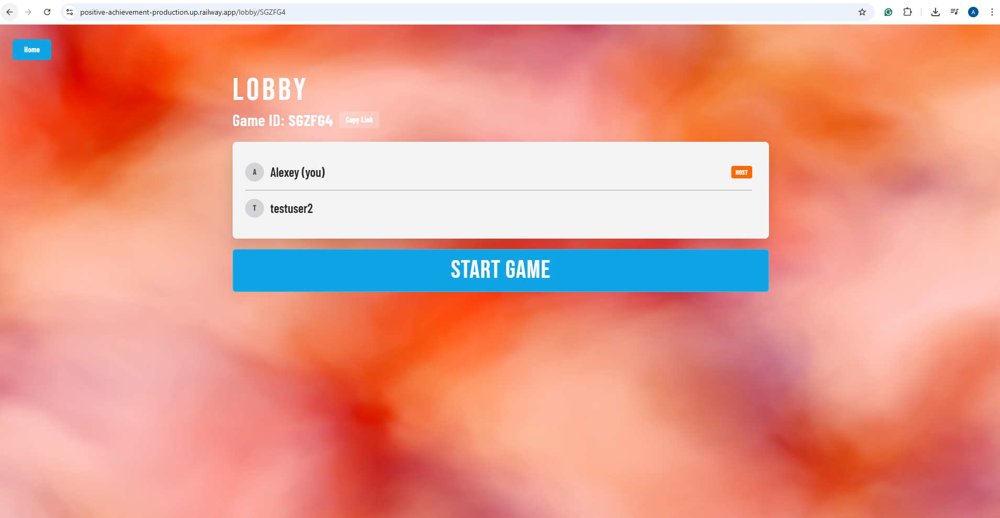
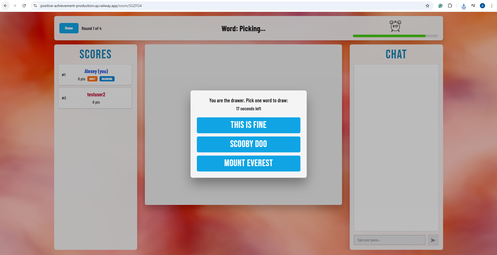
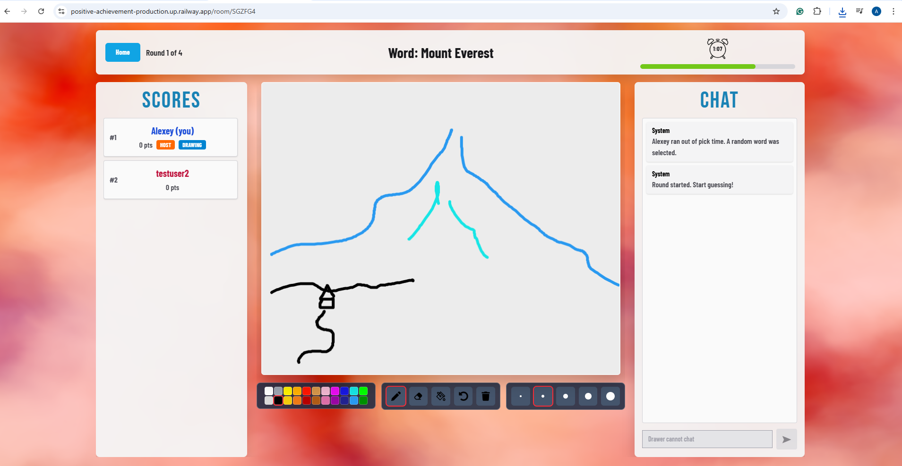
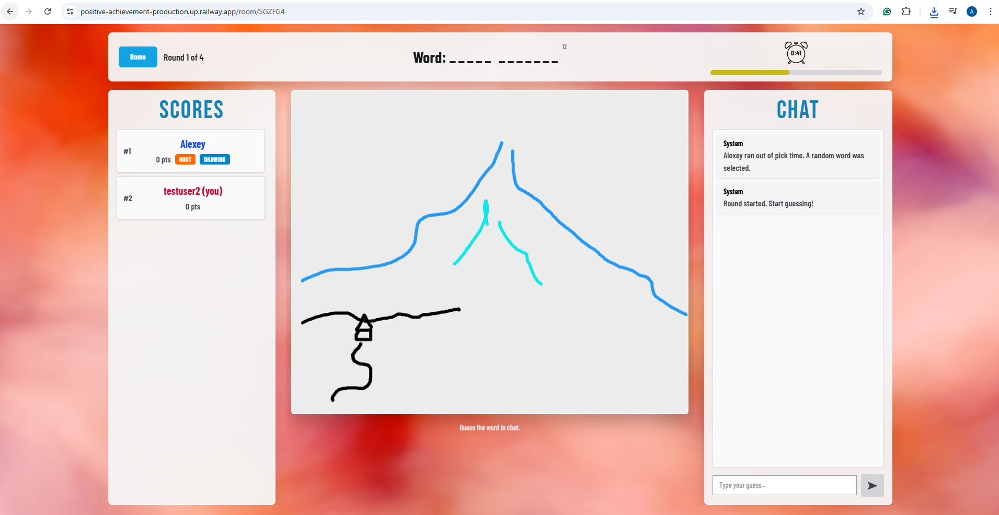
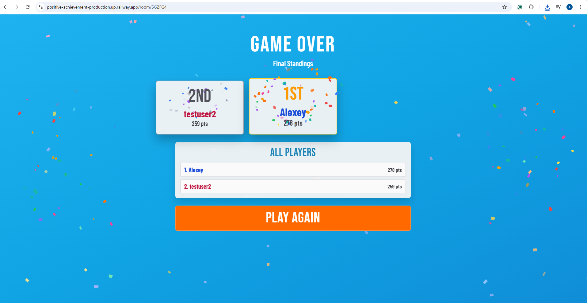

# Scribble Squad

A real-time multiplayer drawing and guessing game where players take turns sketching a word while others race to guess it. Inspired by classic party games like Skribbl.io.

## Screenshots

| Home | Lobby | Word Picking |
|:---:|:---:|:---:|
|  |  |  |

| Drawing | Guessing | Podium |
|:---:|:---:|:---:|
|  |  |  |

## How It Works

1. **Create or join a room** and share the game link with friends
2. **Each round**, one player is chosen as the drawer and picks a word from three options
3. **The drawer sketches** the word on a shared canvas while everyone else types guesses in the chat
4. **Points are awarded** based on how quickly you guess correctly — the faster you guess, the more points you earn
5. **After all rounds**, the final podium reveals the top three players with confetti and fanfare

## Features

- Real-time drawing canvas with brush, eraser, undo, and clear tools
- Live chat with instant guess feedback and close-guess hints
- Synthesized sound effects using the Web Audio API
- Animated fog background powered by Vanta.js and Three.js
- Confetti and podium animations for game over celebrations
- Responsive design that works on desktop and mobile
- Room-based multiplayer with sharable invite links

## Tech Stack

### Frontend

- **React 18** with **TypeScript** — component-based UI
- **Redux Toolkit** — global state management for room, players, and game phase
- **Tailwind CSS v4** — utility-first styling
- **Vite** — fast development server and production bundler
- **Vanta.js + Three.js** — animated WebGL fog background
- **Web Audio API** — synthesized sound effects for clicks, hover, round transitions, and game over

### Backend

- **Node.js** with **Express** — HTTP API for room creation, joining, guessing, and drawing
- **WebSockets (ws)** — real-time bidirectional communication for live game updates, canvas syncing, and chat

### Real-Time Communication

The frontend establishes a **WebSocket** connection to the backend when entering a room. The server broadcasts room state snapshots to all connected clients whenever the game state changes (player joins, guess submitted, stroke drawn, round ends, etc.), keeping every player's view in sync without polling.

## Getting Started

### Prerequisites

- Node.js 18+
- npm

### Installation

```bash
# Clone the repository
git clone https://github.com/Alexeygrekov/Scribble-Squad.git
cd Scribble-Squad

# Install backend dependencies
cd backend
npm install

# Install frontend dependencies
cd ../frontend
npm install
```

### Running Locally

Start both the backend and frontend in separate terminals:

```bash
# Terminal 1 — Backend (runs on port 8080)
cd backend
npm run dev

# Terminal 2 — Frontend (runs on port 5173)
cd frontend
npm run dev
```

Open [http://localhost:5173](http://localhost:5173) in your browser.

## Deployment

The app is deployed on [Railway](https://railway.com) as two separate services:

- **Frontend** — static Vite build served via Caddy
- **Backend** — Node.js server with WebSocket support

Environment variables:

| Service | Variable | Value |
|---|---|---|
| Frontend | `VITE_API_URL` | Backend public URL |
| Backend | `CORS_ORIGIN` | Frontend public URL |
| Backend | `PORT` | `8080` |
